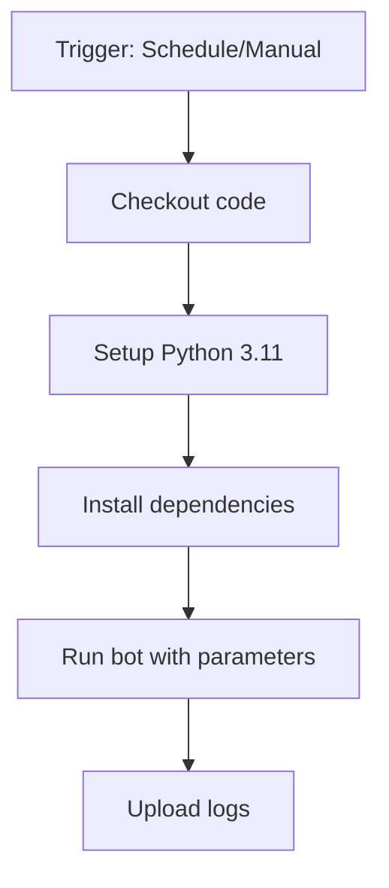

# Настройка GitHub Actions для баскетбольного бота

## Обзор

GitHub Actions позволяет автоматически запускать бота по расписанию и вручную.

## Автоматический запуск

Бот запускается автоматически:
- **Понедельник и среда в 12:00 МСК** - опрос о посещении тренировки
- **Вторник и четверг в 12:00 МСК** - напоминание о тренировке

## Ручной запуск

Можно запустить бота вручную с разными параметрами:
- `auto` - автоматическое определение действия по дню недели
- `welcome` - отправка приветственного сообщения (только вручную)
- `poll` - отправка опроса
- `reminder` - отправка напоминания

## Настройка секретов

В репозитории GitHub нужно добавить следующие Secrets:

1. `TELEGRAM_BOT_TOKEN` - токен вашего Telegram бота
2. `TELEGRAM_CHAT_ID` - ID чата для отправки сообщений

### Как получить токен бота

1. Найдите [@BotFather](https://t.me/botfather) в Telegram
2. Отправьте команду `/newbot`
3. Следуйте инструкциям для создания бота
4. Скопируйте полученный токен

### Как получить ID чата

1. Добавьте бота в чат
2. Отправьте любое сообщение в чат
3. Используйте скрипт `get_group_id.py` для получения ID

## Структура workflow

## Диагностика

Проверить логи выполнения можно в разделе Actions репозитория GitHub. Логи бота сохраняются как артефакты `bot-logs`.

## Восстановление после сбоев

Если бот не работает:
1. Проверьте правильность токена и ID чата в Secrets
2. Убедитесь, что бот добавлен в чат и имеет права на отправку сообщений
3. Проверьте логи выполнения в GitHub Actions
4. Протестируйте локально с теми же переменными окружения
