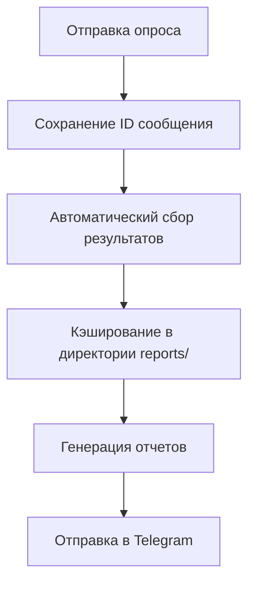

# 📊 Система аналитики посещаемости

## Обзор

Система аналитики позволяет автоматически собирать, хранить и анализировать результаты опросов о посещении тренировок. Бот кэширует все результаты и генерирует подробные отчеты с наглядным форматированием.

## 🏗 Архитектура

### Основные компоненты

- **`reports/poll_analytics.py`** - Ядро системы аналитики с расчетами и форматированием
- **`reports/poll_tracker.py`** - Интеграция с Telegram API и отправка отчетов
- **`reports/generate_reports.py`** - Генерация и отправка различных типов отчетов
- **`reports/`** - Директория модуля аналитики и данных

### Поток данных



## 🚀 Использование

### Локальный запуск

#### Создание тестовых данных
```bash
python reports/generate_reports.py test_data
```

#### Отправка отчета по посещаемости
```bash
python reports/generate_reports.py attendance 30
```

#### Отправка месячного отчета
```bash
python reports/generate_reports.py monthly 2024 3
```

#### Отправка годового отчета
```bash
# За текущий год
python reports/generate_reports.py yearly

# За конкретный год
python reports/generate_reports.py yearly 2024
```

#### Полный отчет
```bash
python reports/generate_reports.py full
```

#### Через основной бот
```bash
# Отчет по посещаемости
python simple_bot.py attendance

# Месячный отчет
python simple_bot.py monthly

# Годовой отчет
python simple_bot.py yearly

# Приветственное сообщение
python simple_bot.py welcome
```

### Автоматизация через GitHub Actions

#### Расписание
- **Еженедельно** (воскресенье 20:00 МСК) - отчет по посещаемости
- **Ежемесячно** (1 число 10:00 МСК) - месячный отчет
- **Ежегодно** (1 января 12:00 МСК) - годовой отчет
- **Вручную** - любой тип отчета через Actions UI

#### Запуск вручную
1. Перейдите в раздел Actions
2. Выберите "Analytics and Reports"
3. Нажмите "Run workflow"
4. Выберите тип отчета и параметры:
   - **attendance** - отчет по посещаемости (можно указать количество дней)
   - **monthly** - месячный отчет (можно указать год и месяц)
   - **yearly** - годовой отчет (можно указать год)
   - **full** - полный отчет (месячный + посещаемость)

## 📊 Типы отчетов

### 1. Отчет по посещаемости
Показывает статистику за указанный период:
- Общая статистика (всего игроков, активных, средняя посещаемость)
- Топ-5 игроков с медалями и визуальными индикаторами
- Детальная разбивка по типам ответов
- Легенда с объяснением эмодзи

### 2. Месячный отчет
Комплексный отчет за месяц:
- Общее количество тренировок и среднее участие
- Процент явки от общего числа игроков
- Топ-5 игроков с детальной статистикой
- Методология расчета посещаемости

### 3. Годовой отчет
Комплексная статистика за год:
- Общая статистика за весь год
- Помесячная разбивка с индикаторами
- Топ-10 игроков года с медалями
- Аналитика динамики посещаемости

### 4. Полный отчет
Сочетание месячного отчета и статистики посещаемости

## 🎨 Форматирование отчетов

### Визуальные индикаторы
- **🔥** Отличная посещаемость (≥80%)
- **👍** Хорошая посещаемость (≥60%)
- **📊** Средняя посещаемость (≥40%)
- **⚠️** Низкая посещаемость (<40%)

### Медали для топ игроков
- **🥇** 1 место
- **🥈** 2 место
- **🥉** 3 место
- **🏅** 4-5 места

### Структура отчета
```
🏀 НАЗВАНИЕ ОТЧЕТА

� Период: информация о периоде

📊 ОБЩАЯ СТАТИСТИКА:
• Ключевые метрики

🏆 РЕЙТИНГ ИГРОКОВ:
🥇 Игрок 1 🔥
   Посещаемость: X% (X/X)
   Детали: ✅X ❌X 🤔X ⏰X

📈 АНАЛИТИКА:
• Методология расчета
• Дополнительная информация

💾 Ссылка на полные данные
```

## �📁 Структура директории reports/

```
reports/
├── polls.json          # Все результаты опросов
├── stats.json          # Кэшированная статистика
├── monthly_reports/     # Месячные отчеты (опционально)
└── .gitignore          # Исключение временных файлов
```

### Формат опроса
```json
{
  "poll_id": "poll_123_20240312",
  "date": "2024-03-12",
  "question": "Баскетбол во вторник (13.03.2024) 🏀",
  "training_date": "13.03.2024",
  "total_votes": 8,
  "options": ["✅ Буду", "❌ Не смогу", "🤔 Еще не знаю", "⏰ Планирую опоздать"],
  "votes": {"✅ Буду": 5, "❌ Не смогу": 1, "🤔 Еще не знаю": 1, "⏰ Планирую опоздать": 1},
  "voters": ["user1", "user2", ...],
  "created_at": "2024-03-12T10:00:00"
}
```

### Формат статистики игрока
```json
{
  "player_id": "user123",
  "player_name": "Иван Иванов",
  "total_polls": 15,
  "attended": 12,
  "skipped": 2,
  "maybe": 1,
  "late": 0,
  "attendance_rate": 80.0
}
```

## 🔧 Конфигурация

### Настройка периодов
В файле `poll_analytics.py` можно изменить:
- Период по умолчанию для статистики (30 дней)
- Форматы даты
- Количество игроков в топе
- Пороги для визуальных индикаторов

### Кастомизация отчетов
В `poll_tracker.py` можно настроить:
- Форматирование сообщений
- Язык отчетов
- Дополнительные метрики
- Эмодзи и визуальные элементы

## 📈 Примеры отчетов

### Отчет по посещаемости
```
📊 СТАТИСТИКА ПОСЕЩАЕМОСТИ

📅 Период: последние 30 дней

📈 ОБЩАЯ СТАТИСТИКА:
• Всего игроков в базе: 12
• Активных игроков: 10
• Средняя посещаемость: 75.5%

🏆 ТОП-5 ИГРОКОВ:

🥇 Иван Иванов 🔥
   Посещаемость: 95% (19/20)
   Детали: ✅17 ❌1 🤔1 ⏰1

🥈 Петр Петров 👍
   Посещаемость: 85% (17/20)
   Детали: ✅15 ❌2 🤔2 ⏰1

💡 ЛЕГЕНДА:
• 🔥 Отличная посещаемость (≥80%)
• 👍 Хорошая посещаемость (≥60%)
```

### Годовой отчет
```
🏀 ГОДОВОЙ ОТЧЕТ ПО ПОСЕЩАЕМОСТИ

📅 Год: 2024

📊 ОБЩАЯ СТАТИСТИКА ЗА ГОД:
• Всего тренировок: 48
• Среднее участие: 6.2 человек
• Явка: 77.5% (из 8 игроков)

📈 СТАТИСТИКА ПО МЕСЯЦАМ:
Январь: 4 тренировки, 5.8 в среднем 👍
Февраль: 4 тренировки, 6.5 в среднем 🔥
Март: 4 тренировки, 7.2 в среднем 🔥
...

🏆 ТОП-10 ИГРОКОВ ЗА ГОД:

🥇 Иван Иванов 🔥
   Посещаемость: 95% (46/48)

🥈 Петр Петров 🔥
   Посещаемость: 88% (42/48)
```

## 🛠 Расширение системы

### Добавление новых метрик
```python
# В классе PollAnalytics
def calculate_custom_metric(self, days_back: int = 30):
    polls = self.get_polls_by_date_range(...)
    # Ваша логика
    return result
```

### Интеграция с внешними системами
- Google Sheets для визуализации
- Power BI для продвинутой аналитики
- Slack для уведомлений

### Уведомления
```python
# Автоматические уведомления при низкой посещаемости
if attendance_rate < 50:
    await send_alert_message("Низкая посещаемость!")
```

## 🔒 Безопасность

- Все данные хранятся локально в репозитории
- Переменные окружения зашифрованы в GitHub Secrets
- Нет передачи личных данных сторонним сервисам
- Graceful обработка ошибок без раскрытия чувствительных данных

## 🐛 Устранение проблем

### Ошибки при отправке отчетов
1. Проверьте переменные окружения `BOT_TOKEN` и `GROUP_ID`
2. Убедитесь, что бот имеет права администратора
3. Проверьте логи в GitHub Actions
4. Проверьте наличие `GITHUB_TOKEN` для Git операций

### Отсутствие данных
1. Запустите `python reports/generate_reports.py test_data` для создания тестовых данных
2. Убедитесь, что опросы отправляются корректно
3. Проверьте права доступа к директории `reports/`

### Некорректная статистика
1. Проверьте форматы данных в `reports/polls.json`
2. Убедитесь, что даты в правильном формате
3. Проверьте логику расчета в `calculate_player_stats()`

### Ошибки Node.js в GitHub Actions
1. Убедитесь, что `FORCE_JAVASCRIPT_ACTIONS_TO_NODE24: true` добавлен в workflow
2. Проверьте, что все actions используют актуальные версии

## 📝 Дорожная карта

- [ ] Визуализация данных через графики
- [ ] Прогнозирование посещаемости
- [ ] Интеграция с календарем
- [ ] Мобильное приложение для игроков
- [ ] Система уведомлений об изменениях в расписании
- [ ] Экспорт отчетов в PDF/Excel
- [ ] Сравнительная статистика между периодами
